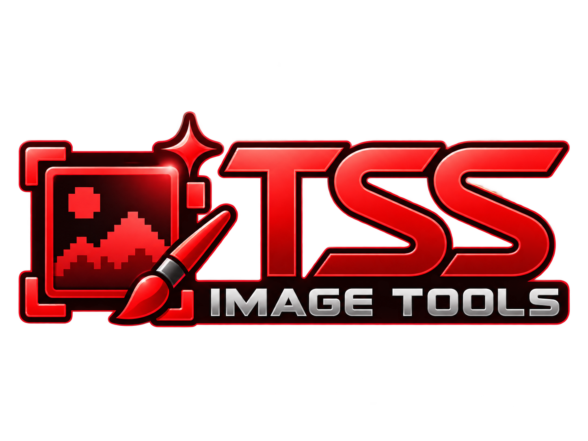
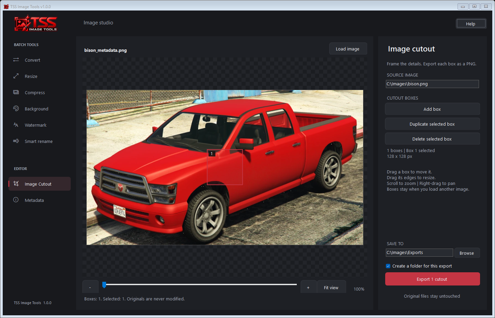
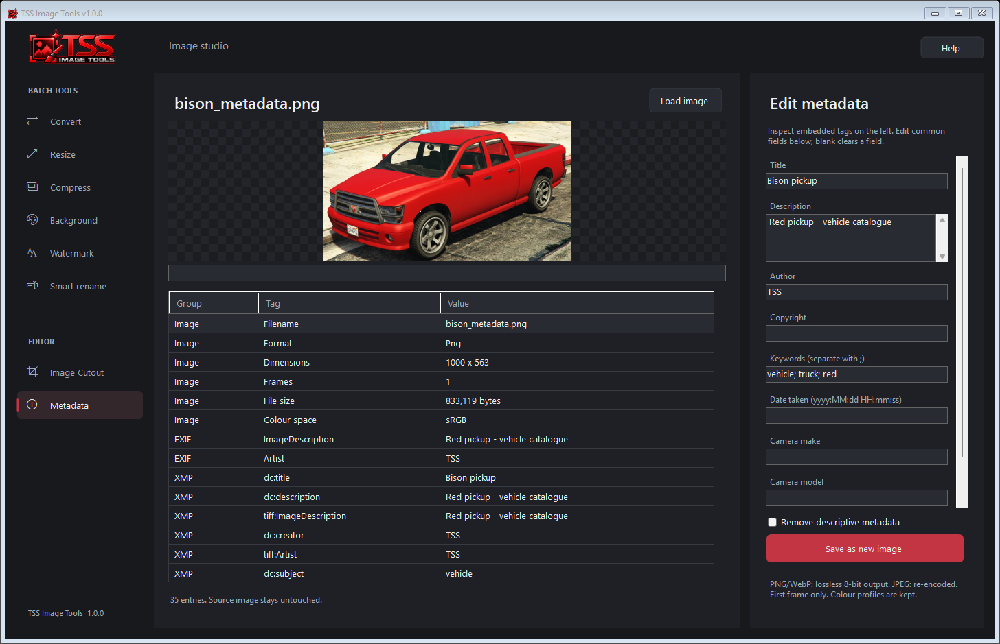
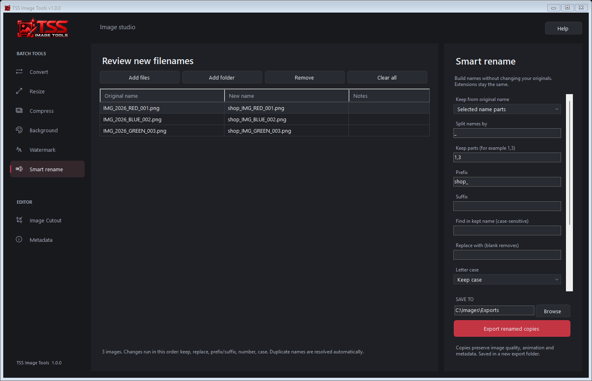

# TSS Image Tools

**A desktop image toolkit for creators, developers and everyday image jobs.**

Convert, resize, compress, remove backgrounds, add watermarks, extract cutouts, edit metadata and organise filenames in one Windows app.

**v1.0.0 · Windows x64 · Batch processing · Originals preserved**

[**Download the latest release**](https://github.com/TinySprite-Studios/TSS-Image-Tools/releases/latest)

## Download and run

1. Open **[Releases](https://github.com/TinySprite-Studios/TSS-Image-Tools/releases/latest)** and download **TSS-Image-Tools-win-x64.zip** from the release assets.
2. Extract the **entire ZIP** into a folder.
3. Run **TssImageTools.App.exe**.

Keep the `assets`, `models`, `licenses` folders and DLL files beside the EXE. Moving just the EXE will leave required files behind. Use the release ZIP rather than GitHub's automatically generated **Source code** downloads.

The release includes the background-removal model and runtime. No Python installation, account or separate model download is needed.

## Explore the app

These screenshots show the v1.0.0 app with example images and filenames.

### Image Cutout

Open the editor directly from the sidebar, load an image and place boxes around the areas you want to export. Resize boxes, duplicate selections and zoom in for precise placement. Your cutout work stays in place when switching tools during the session.

### Metadata

Inspect and search embedded EXIF, IPTC and XMP tags. Edit title, description, author, copyright, keywords, capture date, camera and software fields, then save a new image. You can also remove descriptive metadata while keeping colour profiles.

Metadata exports support PNG, JPEG and WebP. PNG/WebP outputs are lossless 8-bit images; JPEG is re-encoded. Only the first frame is saved. Technical tags are available for inspection; the editable fields appear on the right.

### Smart rename

Review new filenames before exporting renamed copies. Combine prefixes, suffixes, numbering, find/replace and case changes. Keep the whole name, a character range or selected parts separated by a delimiter.

For example, keep parts **1 and 3** of `IMG_2026_RED_001.png`, add `shop_` and enable numbering to produce `shop_IMG_RED_001.png`. Renamed copies preserve file contents, and duplicate names receive a unique suffix.

## Tools at a glance

| Tool | What you can do |
| --- | --- |
| Convert | Export PNG, JPG, WebP, GIF, BMP or ICO. GIF output is single-frame. |
| Resize | Set dimensions with Stretch, Center or Fit modes. |
| Compress | Adjust output quality to reduce file size. |
| Background | Use **Auto removal** for subjects or **Background colour** for plain backgrounds, with a 0-100% tolerance slider and editable value. |
| Watermark | Add text or a logo; set position, opacity, margin and size, or tile it across the image. |
| Smart rename | Preview naming rules and export renamed copies of up to 5,000 files. |
| Image Cutout | Create and export multiple rectangular cutouts from an image. |
| Metadata | Inspect tags, edit descriptive fields or remove metadata, then save a new copy. |

Auto removal uses bundled ONNX Runtime and U2Net. The first preview can take longer while the model loads. Review fine edges, glass and images containing many separate objects before exporting.

## Batch workflow

1. Choose a tool from the sidebar.
2. Add files or a folder.
3. Adjust the settings and review the preview.
4. Choose where to save and click **Export**.

Batch exports go into a new timestamped folder beneath your chosen destination. Metadata uses a Save As dialog; Image Cutout has its own export controls. Original files stay untouched.

| Tool | Batch limit |
| --- | ---: |
| Convert, Resize, Compress | 5,000 images |
| Smart rename | 5,000 images |
| Watermark | 100 images |
| Background | 50 images |

## Image Cutout shortcuts

| Shortcut | Action |
| --- | --- |
| Ctrl+O | Load an image |
| Ctrl+D | Duplicate the selected box |
| Delete | Remove the selected box |
| Ctrl+Enter | Export cutouts |
| Mouse wheel | Zoom |
| Right-drag | Pan |

## Feedback

Found a problem or have a feature idea? [Open an issue](https://github.com/TinySprite-Studios/TSS-Image-Tools/issues) and include the tool you were using, your steps and a screenshot where helpful.

Third-party licence information is included in the `licenses` folder of the release.